# 🚀 Register App - Full Deployment Pipeline

This document outlines the complete CI/CD pipeline and deployment strategy for the **Register App** using a modern DevOps stack. The process includes build, analysis, containerization, deployment to Kubernetes, and observability setup.

---

## 📌 Stack Overview

| Tool           | Purpose                             |
| -------------- | ----------------------------------- |
| **Jenkins**    | CI orchestration                    |
| **SonarQube**  | Static code analysis                |
| **Trivy**      | Security vulnerability scanning     |
| **Docker**     | Image building and containerization |
| **Kubernetes** | Container orchestration platform    |
| **Helm**       | Kubernetes package management       |
| **ArgoCD**     | GitOps-based Kubernetes deployment  |
| **Prometheus** | Metrics collection and alerting     |
| **Grafana**    | Metrics visualization               |

---

## 🛠️ CI Setup with Jenkins

### 🔌 Required Jenkins Plugins

Install the following plugins:

* **Maven Integration**
* **Pipeline Maven Integration**
* **Eclipse Temurin Installer**
* **SonarQube**
* **Sonar Quality Gates**
* **Docker**
* **Docker Commons**
* **Docker Pipeline**
* **Kubernetes CLI Plugin**
* **GitHub Integration**
* **Generic Webhook Trigger**

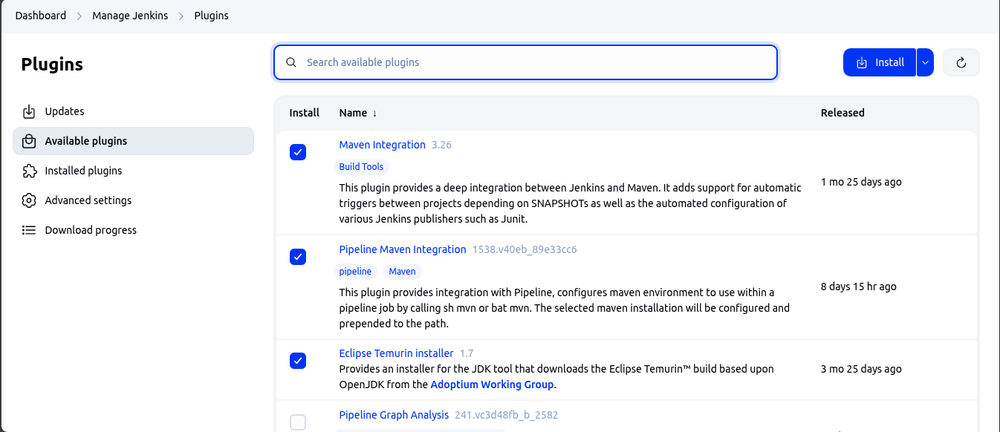

---

### 🧰 Jenkins Tools Configuration

Ensure Maven and JDK are properly configured.

#### ✅ Maven

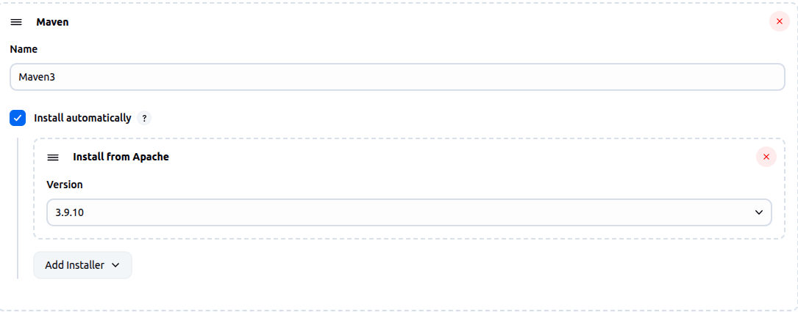

#### ✅ JDK (Temurin)

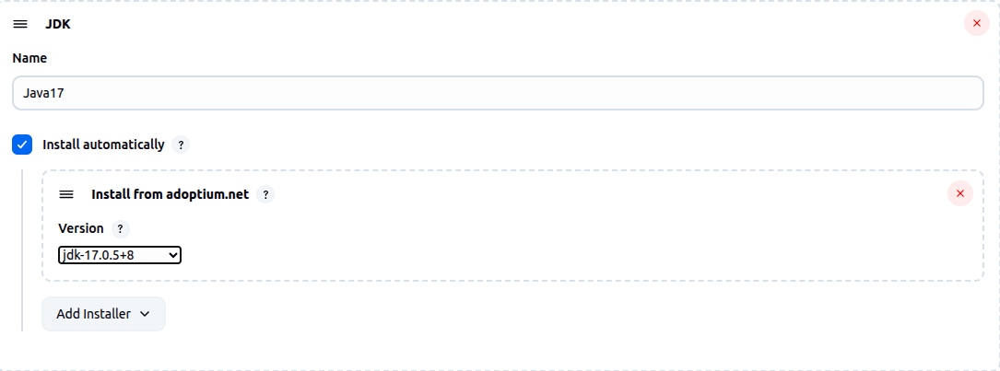

---

## 📂 Source Code Management

Configure Git in Jenkins Pipeline:
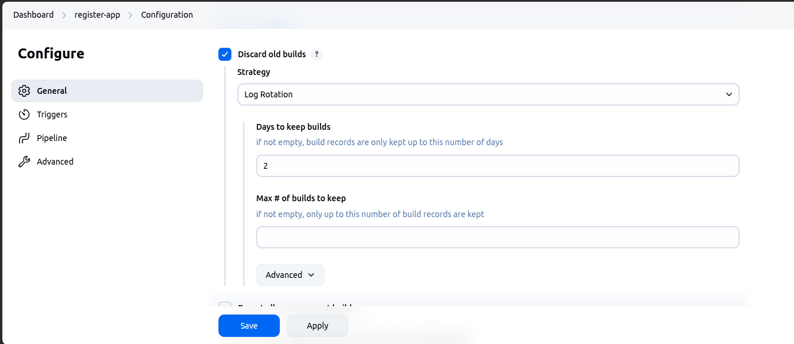
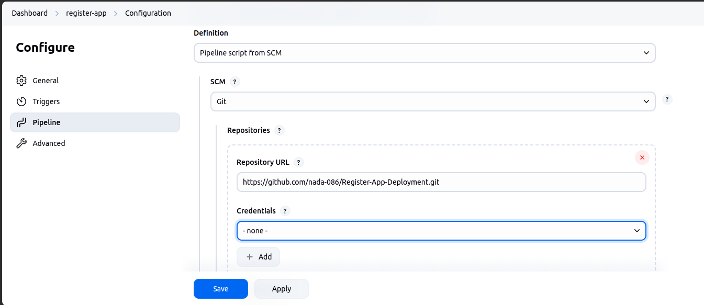

---

## 🔍 Static Code & Security Scanning

### 📊 SonarQube Setup

```bash
docker run -d --name sonarqube -p 9000:9000 sonarqube:lts
```

1. Access SonarQube UI: `http://localhost:9000`
2. Create a **project token**

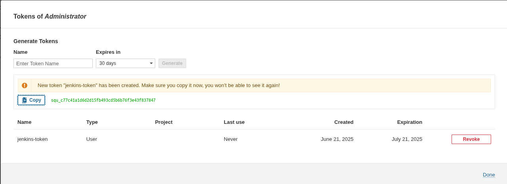

3. Add token to Jenkins credentials:

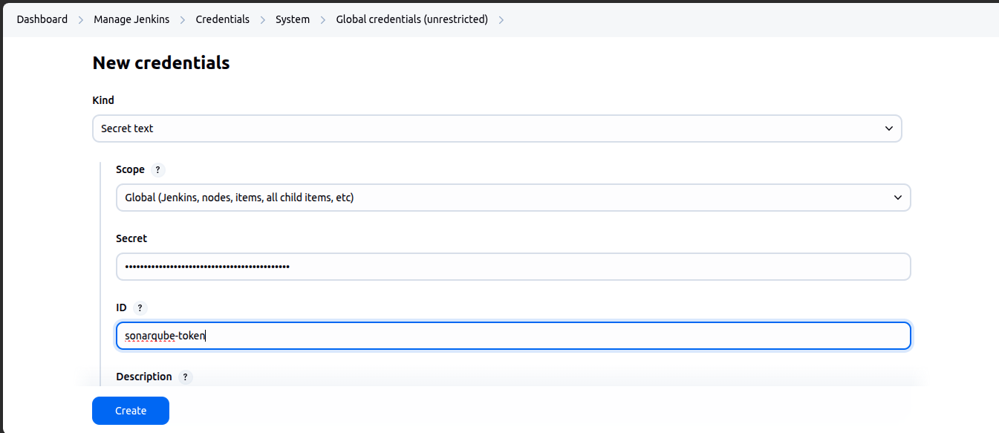

4. Configure SonarQube on Jenkins System
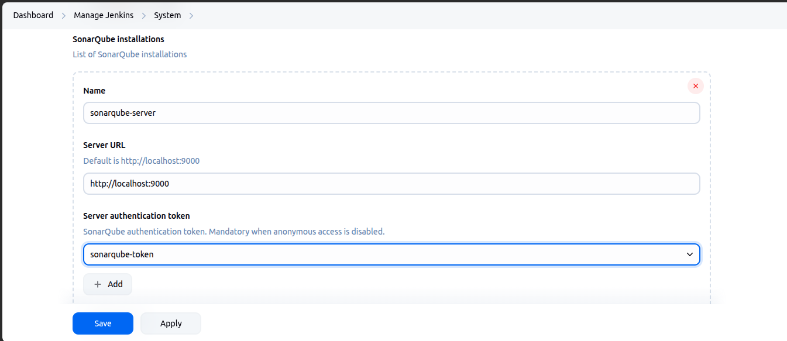

5. Configure SonarQube Scanner Tool on Jenkins
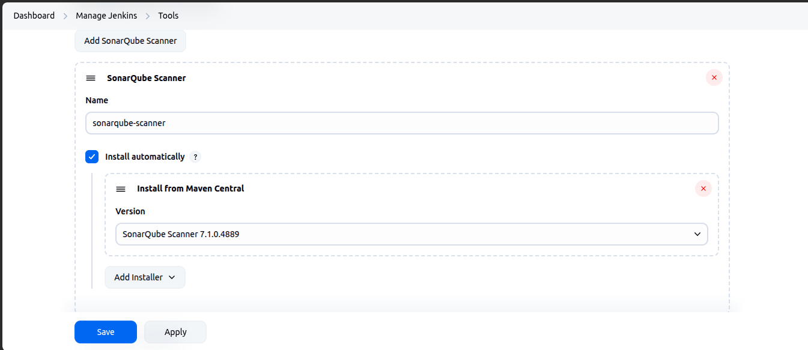

6. Create SonarQube Webhook
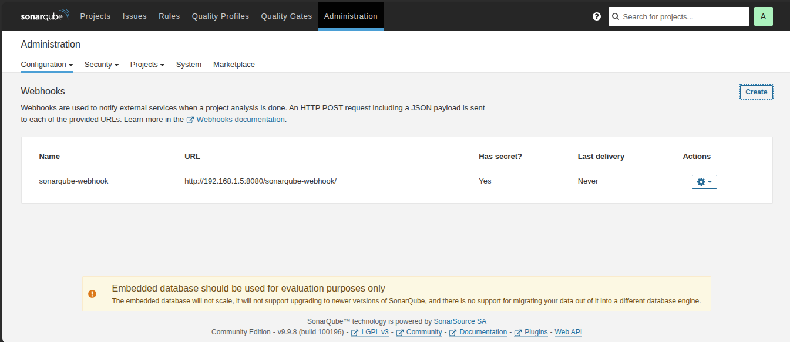

---

### 🔒 Trivy Installation

```bash
sudo apt-get install wget gnupg
wget -qO - https://aquasecurity.github.io/trivy-repo/deb/public.key | gpg --dearmor | sudo tee /usr/share/keyrings/trivy.gpg > /dev/null
echo "deb [signed-by=/usr/share/keyrings/trivy.gpg] https://aquasecurity.github.io/trivy-repo/deb generic main" | sudo tee -a /etc/apt/sources.list.d/trivy.list
sudo apt-get update
sudo apt-get install trivy
```

---

### Docker Setup
- Create a Token for the DockerHub Account
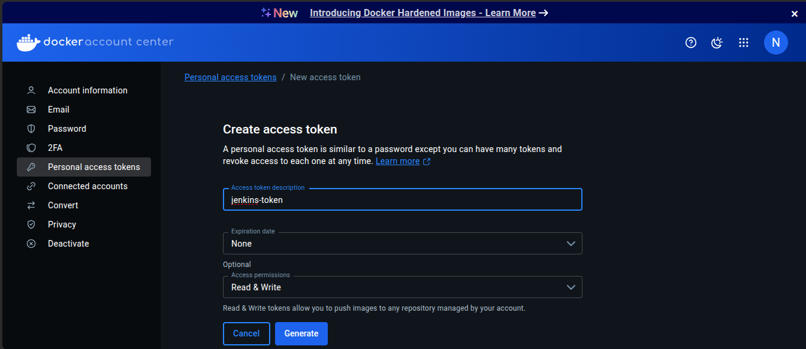
- Add the Token to Jenkins Credentials
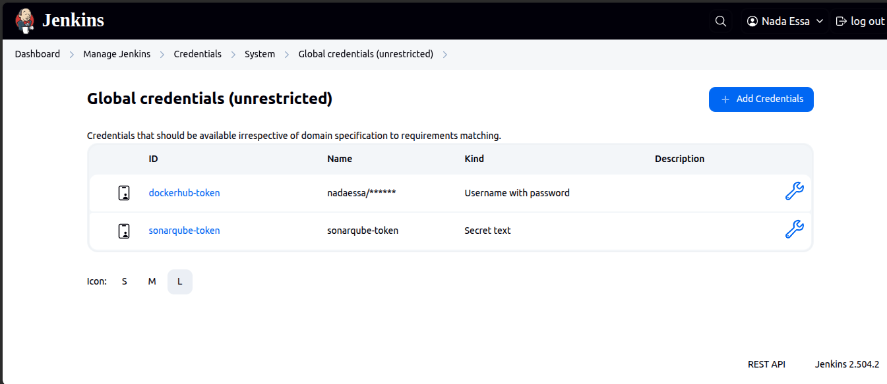


