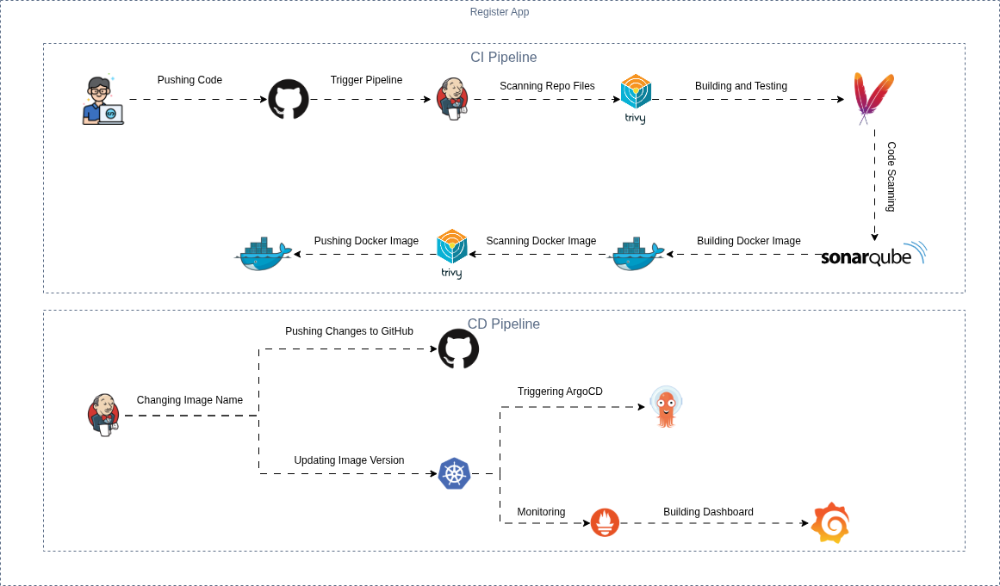

# 🚀 **Register App — End-to-End CI/CD Pipeline**

Welcome to the **Register App** CI/CD deployment guide! This document outlines a fully automated DevOps workflow—from source code to Kubernetes—with continuous integration, delivery, security scanning, and observability.



---

## 🧱 **Technology Stack**

| 🔧 Tool        | 💡 Role                            |
| -------------- | ---------------------------------- |
| **Jenkins**    | Automates build & test (CI)        |
| **SonarQube**  | Code quality & static analysis     |
| **Trivy**      | Container vulnerability scanning   |
| **Docker**     | Builds and packages app containers |
| **Kubernetes** | Runs & orchestrates containers     |
| **Helm**       | Simplifies Kubernetes deployments  |
| **ArgoCD**     | GitOps-based continuous delivery   |
| **Prometheus** | Collects and stores metrics        |
| **Grafana**    | Visualizes metrics and dashboards  |

---

## ⚙️ **CI Setup with Jenkins**

### 🔌 Required Plugins

Ensure Jenkins has the following plugins installed:

* Maven Integration
* Pipeline Maven Integration
* Eclipse Temurin Installer
* SonarQube Scanner & Quality Gates
* Docker (Commons, Pipeline, and Core)
* Kubernetes CLI
* GitHub Integration
* Generic Webhook Trigger

📸 *Plugin Setup Screenshot:*


---

### 🧰 Jenkins Tool Configuration

#### ✅ Maven


#### ✅ JDK (Temurin)


---

## 📂 **Source Code Management (SCM)**

Set up Git in Jenkins to fetch source code for your pipelines.

📸 *SCM Integration & Log Rotation:*


---

## 🧪 **Code Quality & Security Analysis**

### 🔍 SonarQube Integration

Run a local SonarQube server:

```bash
docker run -d --name sonarqube -p 9000:9000 sonarqube:lts
```

1. Open `http://localhost:9000`
2. Generate a **project token**
3. Add token to Jenkins Credentials
4. Configure SonarQube in Jenkins:

   * System Configuration
   * Add SonarQube Scanner tool
   * Set up webhook

📸 *SonarQube Setup Screenshots:*


---

### 🛡️ Trivy — Security Scanning for Docker Images

Install Trivy on your Jenkins host:

```bash
sudo apt-get install wget gnupg
wget -qO - https://aquasecurity.github.io/trivy-repo/deb/public.key | \
  gpg --dearmor | sudo tee /usr/share/keyrings/trivy.gpg > /dev/null
echo "deb [signed-by=/usr/share/keyrings/trivy.gpg] https://aquasecurity.github.io/trivy-repo/deb generic main" | \
  sudo tee /etc/apt/sources.list.d/trivy.list
sudo apt-get update
sudo apt-get install trivy
```

---

## 🐳 **Docker Integration**

1. Create a DockerHub **Access Token**
2. Add it to Jenkins as credentials for Docker builds

📸 *DockerHub Token & Jenkins Credential Setup:*


---

## 🚢 **GitOps Deployment with ArgoCD**

### 🧱 Install ArgoCD

```bash
kubectl create namespace argocd
kubectl apply -n argocd -f https://raw.githubusercontent.com/argoproj/argo-cd/stable/manifests/install.yaml
kubectl port-forward svc/argocd-server -n argocd 8000:443
```

### 🔐 Retrieve Admin Password

```bash
kubectl get secret argocd-initial-admin-secret -n argocd \
  -o jsonpath="{.data.password}" | base64 --decode
```

### 📥 Install ArgoCD CLI

```bash
VERSION=$(curl -s https://api.github.com/repos/argoproj/argo-cd/releases/latest \
  | grep tag_name | cut -d '"' -f 4)
curl -sSL -o argocd "https://github.com/argoproj/argo-cd/releases/download/$VERSION/argocd-linux-amd64"
chmod +x argocd
sudo mv argocd /usr/local/bin/
```

### 🔑 Login to ArgoCD

```bash
argocd login <ARGOCD_HOST> --username admin
```

---

### 🔧 Configure ArgoCD

* Connect your Git repository
* Create and manage ArgoCD applications

📸 *ArgoCD UI:*


---

## 📊 **Monitoring & Observability (Prometheus + Grafana)**

### 🚀 Install Helm

```bash
curl https://raw.githubusercontent.com/helm/helm/master/scripts/get-helm-3 | bash
```

### 📦 Add Repositories

```bash
helm repo add prometheus-community https://prometheus-community.github.io/helm-charts
helm repo add grafana https://grafana.github.io/helm-charts
helm repo update
```

### 📈 Deploy Prometheus & Grafana

```bash
kubectl create namespace monitoring
helm install prometheus prometheus-community/prometheus -n monitoring
helm install grafana grafana/grafana -n monitoring
```

### 🔌 Access Grafana

```bash
kubectl port-forward -n monitoring svc/grafana 3000:80
```

Retrieve admin password:

```bash
kubectl get secret -n monitoring grafana -o jsonpath="{.data.admin-password}" | base64 --decode
```

### 📊 Setup Dashboards

* Add **Prometheus** as a data source in Grafana
* Import Kubernetes or application dashboards

📸 *Grafana Setup:*


