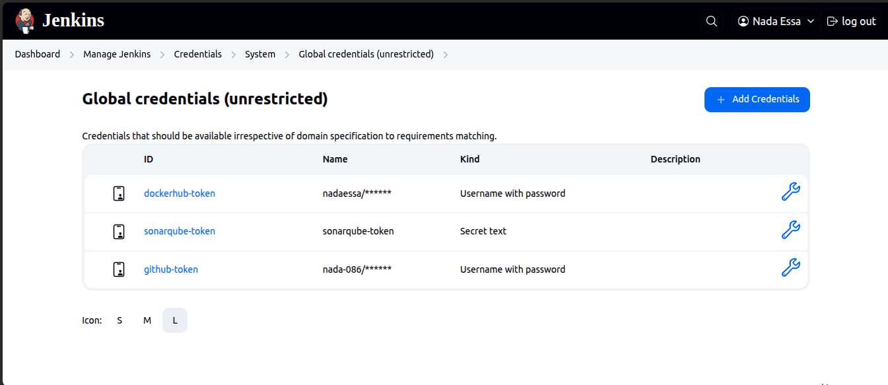

# 🚀 **Register App - End-to-End CI/CD Pipeline**

Welcome to the **Register App** deployment guide! This document details a fully automated CI/CD pipeline powered by a modern DevOps stack—covering build, analysis, containerization, Kubernetes deployment, and observability.

---

## 🧱 **Tech Stack Overview**

| 🔧 Tool        | 💡 Purpose                        |
| -------------- | --------------------------------- |
| **Jenkins**    | Continuous Integration (CI)       |
| **SonarQube**  | Static Code Analysis              |
| **Trivy**      | Security Vulnerability Scanning   |
| **Docker**     | Image Building & Containerization |
| **Kubernetes** | Container Orchestration           |
| **Helm**       | Kubernetes Package Management     |
| **ArgoCD**     | GitOps-Based Continuous Delivery  |
| **Prometheus** | Metrics Collection & Alerting     |
| **Grafana**    | Observability & Dashboarding      |

---

## ⚙️ **CI Configuration with Jenkins**

### 🔌 Required Plugins

Ensure the following Jenkins plugins are installed:

* Maven Integration
* Pipeline Maven Integration
* Eclipse Temurin Installer
* SonarQube & Sonar Quality Gates
* Docker (All: Core, Commons, Pipeline)
* Kubernetes CLI
* GitHub Integration
* Generic Webhook Trigger

📸 *Jenkins Plugin Setup:*


---

### 🧰 Tools Setup in Jenkins

#### ✅ Maven Configuration


#### ✅ JDK (Temurin) Configuration


---

## 📂 **Source Code Management**

Set up your Git integration for Jenkins pipelines.

📸 *SCM Configuration:*

📸 *Log Rotation Setup:*


---

## 🧪 **Code Quality & Security**

### 🔍 SonarQube Integration

```bash
docker run -d --name sonarqube -p 9000:9000 sonarqube:lts
```

1. Access: `http://localhost:9000`
2. Create a **project token**
   
3. Add the token to Jenkins credentials
   
4. Configure in Jenkins System Settings
   
5. Add SonarQube Scanner Tool
   
6. Set up Webhook
   

---

### 🛡️ Trivy for Vulnerability Scanning

Install Trivy to ensure container security:

```bash
sudo apt-get install wget gnupg
wget -qO - https://aquasecurity.github.io/trivy-repo/deb/public.key | gpg --dearmor | sudo tee /usr/share/keyrings/trivy.gpg > /dev/null
echo "deb [signed-by=/usr/share/keyrings/trivy.gpg] https://aquasecurity.github.io/trivy-repo/deb generic main" | sudo tee -a /etc/apt/sources.list.d/trivy.list
sudo apt-get update
sudo apt-get install trivy
```

---

## 🐳 **Docker Integration**

1. Generate DockerHub Token
   

2. Add Token to Jenkins Credentials
   

---

## 🚢 **GitOps Deployment with ArgoCD**

### 🧱 ArgoCD Installation

```bash
kubectl create namespace argocd
kubectl apply -n argocd -f https://raw.githubusercontent.com/argoproj/argo-cd/stable/manifests/install.yaml
kubectl port-forward svc/argocd-server -n argocd 8000:443
```

### 🔐 Get Admin Password

```bash
kubectl get secret argocd-initial-admin-secret -n argocd -o jsonpath="{.data.password}" | base64 -d
```

### 📥 Install ArgoCD CLI

```bash
VERSION=$(curl -s https://api.github.com/repos/argoproj/argo-cd/releases/latest | grep tag_name | cut -d '"' -f 4)
curl -sSL -o argocd "https://github.com/argoproj/argo-cd/releases/download/$VERSION/argocd-linux-amd64"
chmod +x argocd
sudo mv argocd /usr/local/bin/
```

### 🔐 Login to ArgoCD

```bash
argocd login argocd-host-url --username admin
```

---

### 🔧 ArgoCD Configuration

#### 📁 Connect Git Repository


#### 🚀 Create and Manage Applications


---

## 📊 **Observability with Prometheus & Grafana**

### Install Helm
```bash
curl https://raw.githubusercontent.com/helm/helm/master/scripts/get-helm-3 | bash
```

### Add Prometheus and Grafana Repos
```bash
helm repo add prometheus-community https://prometheus-community.github.io/helm-charts
helm repo add grafana https://grafana.github.io/helm-charts
helm repo update
```

### Start Prometheus and Grafana
```bash
kubectl create namespace monitoring
helm install prometheus prometheus-community/prometheus -n monitoring
helm install grafana grafana/grafana -n monitoring
```

- Forward Port
```bash
kubectl port-forward -n monitoring svc/grafana 3000:80
```

- Use the following to find the password for grafana
```bash
kubectl get secret --namespace monitoring grafana -o jsonpath="{.data.admin-password}" | base64 --decode; echo
```

- Add Prometheus as a data source for grafana


- Import Dashboard
